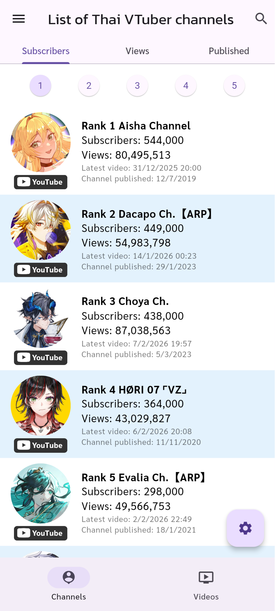
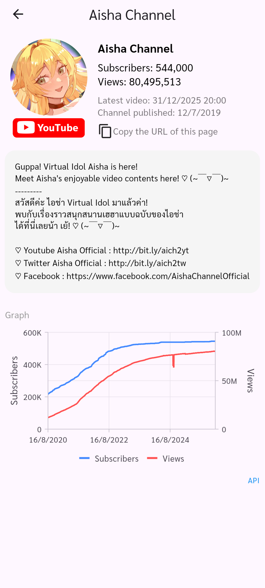
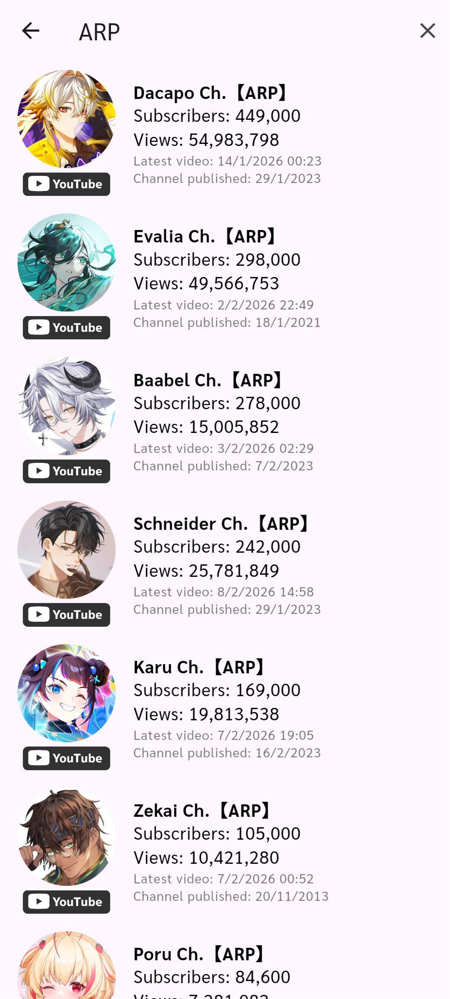
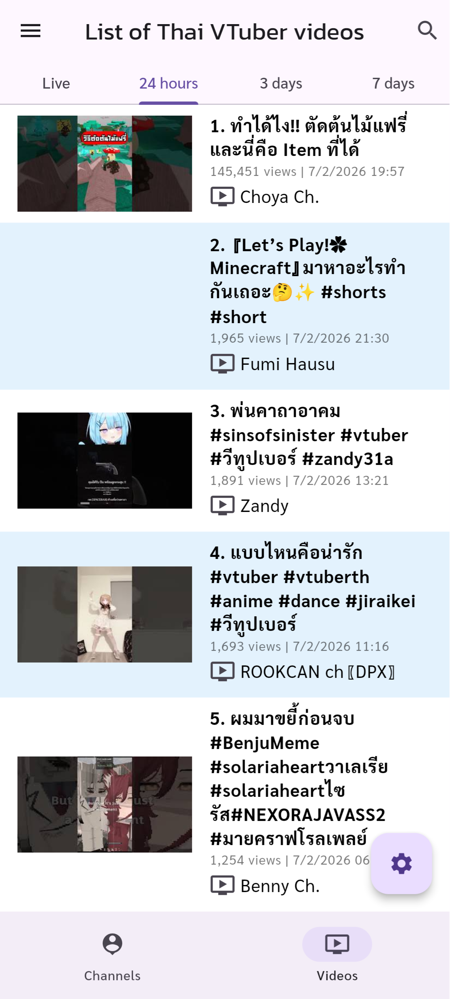
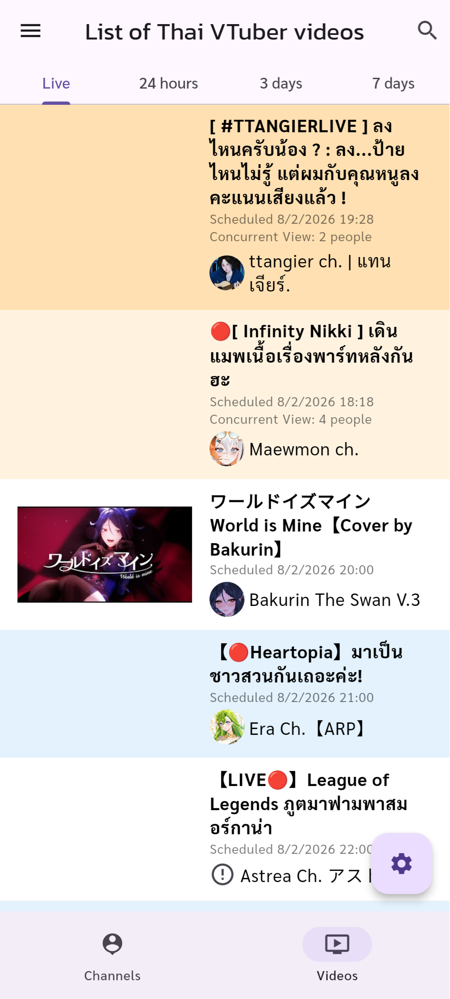
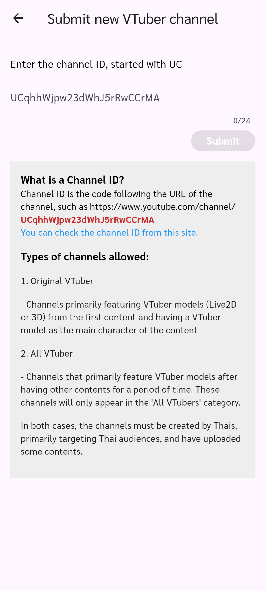
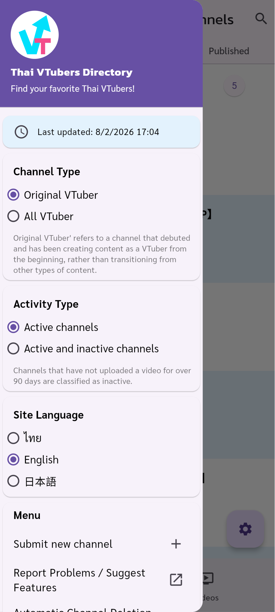
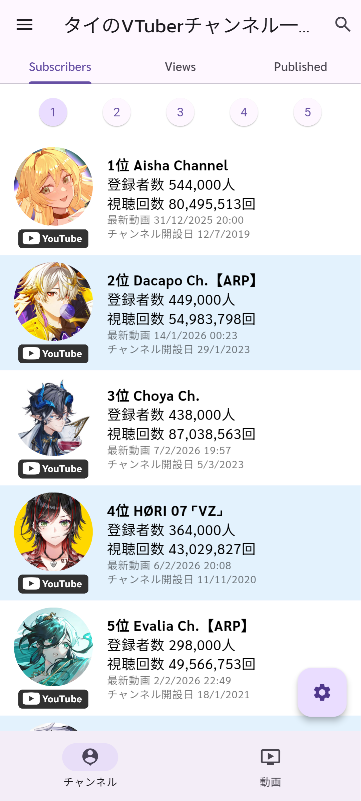

# Flutter Web Version - Feature Archive

This document showcases the features of the original Flutter Web application for Thai VTubers Directory.

> **Note:** This version has been replaced by a new [Next.js version](https://vtuber.chuysan.com). These screenshots are preserved for reference.

---

## Channel Rankings

Browse Thai VTuber channels sorted by subscribers, views, or channel creation date.

---

## Channel Detail

View detailed information about a specific channel including subscriber count, total views, and historical statistics graph.

---

## Channel Search

Search for channels by name with real-time filtering.

---

## Recent Videos

View trending videos from Thai VTubers with daily, 3-day, and 7-day ranking tabs.

---

## Live & Upcoming Streams

See currently live streams and upcoming scheduled broadcasts from Thai VTubers.

---

## Channel Registration

Submit new VTuber channels to be added to the directory. Supports both "Original VTuber" and "All VTuber" categories.

---

## Navigation Menu

Access site settings, language selection, filters, and external links through the drawer menu.

---

## Localization - Thai

Full Thai language support for native users.

---

## Localization - Japanese

Japanese language support for international users.

---

## Tech Stack

- **Framework:** Flutter Web 3.x
- **State Management:** Provider
- **Localization:** Flutter Intl
- **Hosting:** Netlify
- **Backend:** Firebase + Google Cloud Functions

---

*Archive URL: https://vtuber-chuysan.netlify.app*
